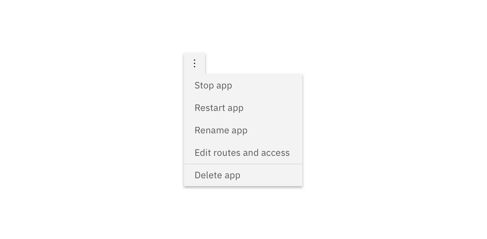

## General guidance

_Overflow menu_ is used when additional options are available to the user and there is a space constraint.

## Format

#### Text

The text within an overflow menu should be direct so users can quickly decide on an action. Actions that could cause a significant change to the user's data (delete app, delete service, etc.) are separated by a horizontal rule and live below the primary set of actions.

<ImageComponent cols="8">

</ImageComponent>

<ImageComponent cols="8">

</ImageComponent>

#### Positioning

Depending on where the Overflow Menu appears within the UI, the caret or arrow may be left or right aligned so the Overflow Menu is clearly visible.

<ImageComponent cols="8" caption="Right-aligned Overflow Menu">

</ImageComponent>

<ImageComponent cols="8" caption="Left-aligned Overflow Menu">

</ImageComponent>