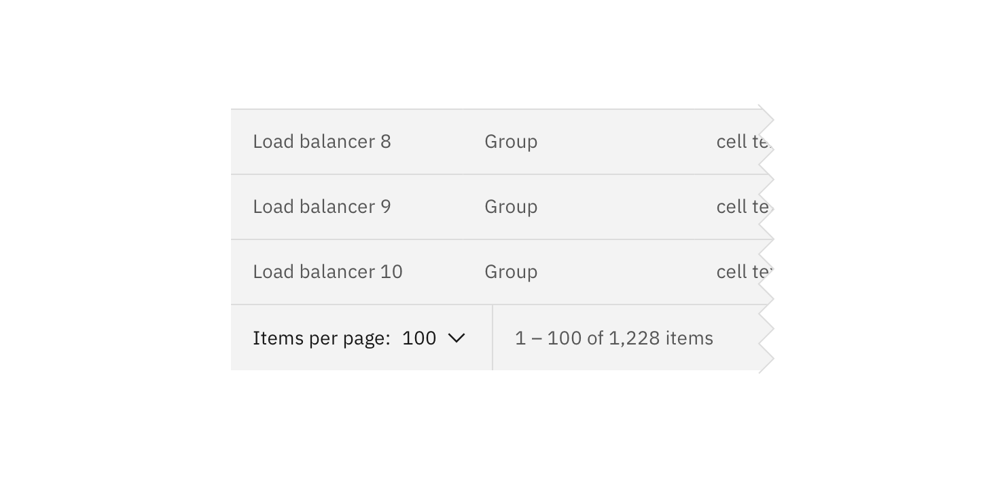

## General guidance

_Pagination_ is used for splitting up content or data into several pages, with a control for navigating to the next or previous page.

Generally, pagination is used if there are more than 25 items displayed in one view. The default number displayed will vary depending on the context.

## Best practices

#### Identify the current page

Clearly identify which page the user is on by displaying the current page number. By providing context into how many pages there are in total (eg. 1 of 4 pages), you can help provide clarity around the data displayed.

#### Provide various options for navigating

_Previous_ and _next_ chevrons or links are the most useful way for the user to move forward or backward through pages of data. Provide an [inline select](/components/select) in which users can choose the page they wish to navigate to.

<ImageComponent cols="8">

</ImageComponent>

<ImageComponent cols="8">

</ImageComponent>

#### Items per page

Use an inline select within the pagination bar so the user can change the amount of data displayed per page.

<ImageComponent cols="8">

</ImageComponent>