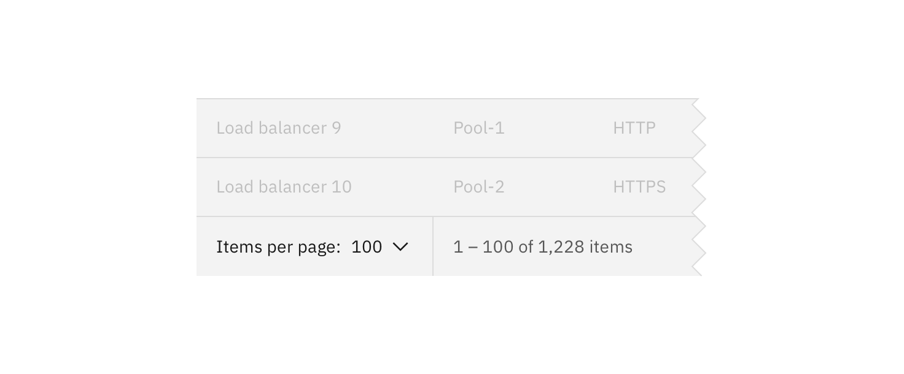

| Select type      | Purpose                                                                                                                                                                                                                                                          |
|------------------|------------------------------------------------------------------------------------------------------------------------------------------------------------------------------------------------------------------------------------------------------------------|
| Default          | Typically used in forms with a variety of other components.                                                                                                                                                                                                                    |
| Small select        | When vertical space is a concern, or Select is being paired with larger component, such as [Cards](/add-ons/card) or [Data Tables](/components/data-table).                                                                                                                                                                                                                               |
| Inline select | When multiple selects are grouped together.                                                                                                                          |

### Small select
Small selects are commonly used in [Data Tables](/components/data-table). When using a Small select for a number selection, the increments in the select should be 10, 25, 50 and 100. The maximum amount of items a user can see per page is 100.

---
***
> 

_Example of Small Select in Data Table_

### Inline select
Inline select is useful when you have multiple `select` fields within a form. Inline selects have less visual weight on a page, since stylistically they are borderless.

---
***
> 

_Example of Inline Select_

 

## General guidelines

### Labels

Labels are essential to the usability of forms because they provide guidance to the data a user might provide. Do not place a label inside a Select element. Use sentence case and no more than three words.

### Validation

Real time validation helps to streamline the process and keep data clean when the user is filling out forms. For full guidelines, refer to the [Forms](/components/form) usage page.

---
***
> 

_Validation on Select_

### Order

The order of the Select list should be based on the frequency of use. If applicable, the list should be in increasing order relative to the content. In cases of Forms, alternative orders such as alphabetical may be more fitting. A horizontal rule can be used to group similar items together.

## Accessibility

### Styling Select dropdowns

It is strongly recommended not to style Select dropdowns due to accessibility purposes.
One of the <a href="https://www.w3.org/TR/WCAG20-TECHS/G202.html" target=blank>WCAG 2.0 standards</a> for accessibility is “Ensuring keyboard control for all functionality.” CSS alternatives to `select` elements to not meet this requirement.

While you can make a Select element easily usable by a mouse, making it usable with keyboard navigation is complex. The default `select` element should follow this process:

|         | Mouse                                    | Keyboard                                            |
|---------|------------------------------------------|-----------------------------------------------------|
| :hover  | move your cursor over the select element | use the tab key to focus the select element         |
| :focus  | click on the select element              | press enter                                         |
| :       | move your cursor over the desired option | use the top and bottom arrow keys to pick an option |
| :select | click on the desired option              | press enter                                         |
