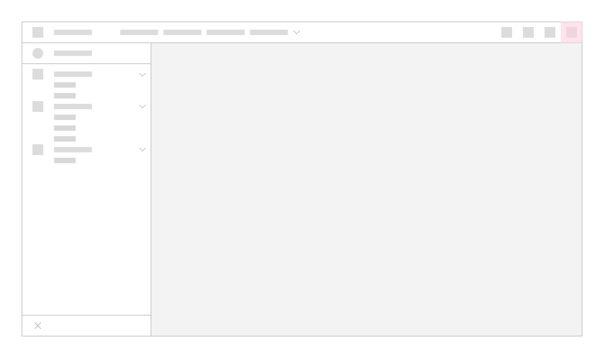
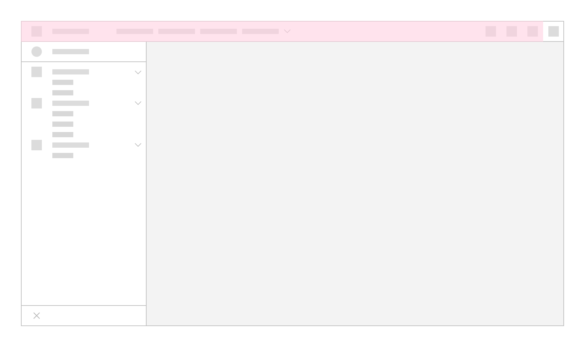
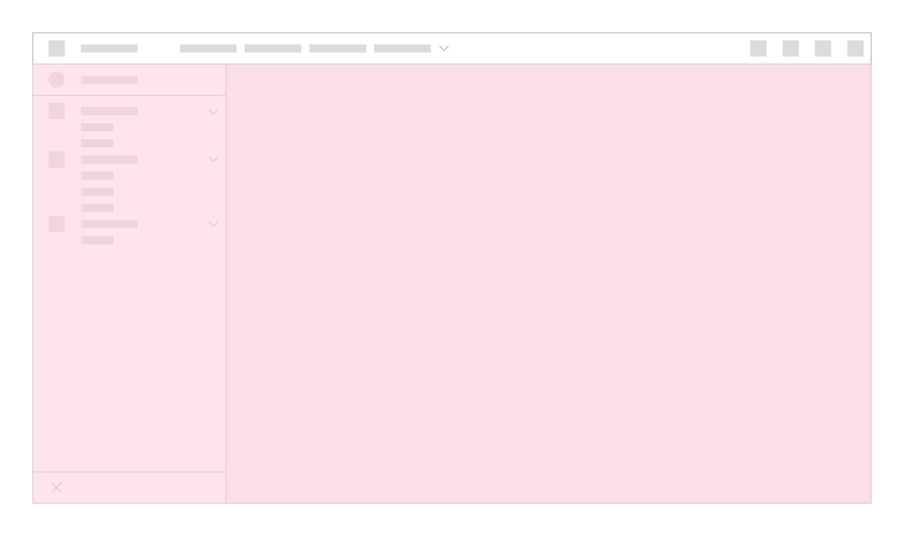
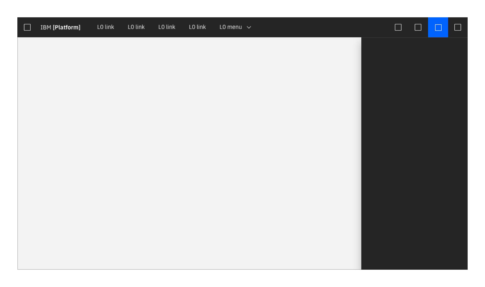
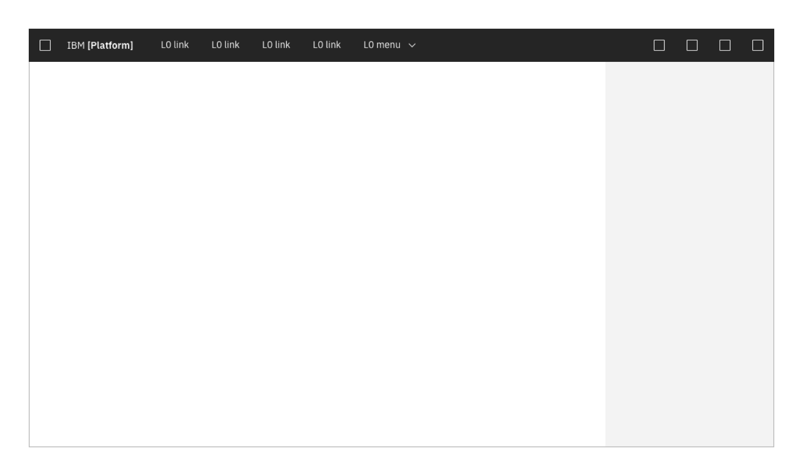
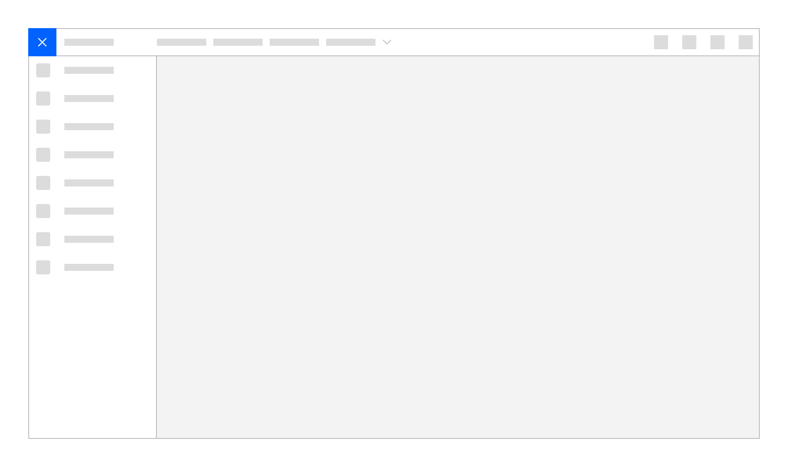
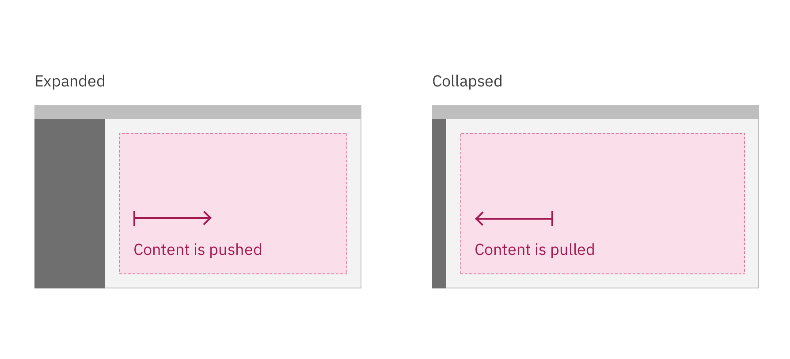
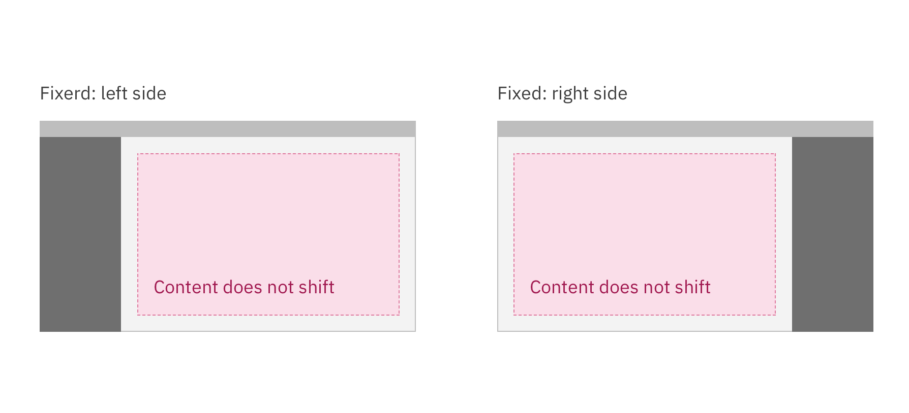

# UI Shell

UI Shell Zones
UI Shell Components
Side Navigation

The UI Shell is the top level in a product's UI. The Shell consists of the primary **header** and **footer**, as well as **header panels** that are used for navigation and global UI services.

## UI Shell Zones
The shell is divided into 3 distinct "zones" which establish purpose and level of control.

The **Global** zone holds the IBM global platform switcher, which allows the user to quickly navigate between different IBM platforms. This zone cannot be altered by the platform or product owner.

The **Platform** zone contains platform-level elements, which could include functions like search, docs, support, profile, and notifications. Platform owners can also choose to include custom top-nav text links in this zone. 

The **Local** zone is controlled at the product level. It contains the product-level side nav as well as the main content area.

## UI Shell Components
### Primary Header

The Header spans the full width of the viewport and is the topmost element in the UI. Header elements are persistent within a product. The header contains:

1. **Platform icon or L1 menu icon.** If your platform includes a L1 product-switcher (e.g. IBM Cloud), then this space will hold a hamburger menu to activate the switcher. If not, the platform icon sits here.
* **Platform name** (e.g. Cloud, IoT, Watson). The platform name is always preceded by "IBM."
* **Up to 5 optional horizontal platform-levl nav links and/or dropdown menus.** If using a dropdown, include the down-pointing chevron after the link label. Dropdowns open on click and are closed by either selecting an item in the menu, clicking outside the menu area, or clicking on the menu label.  
* **L0 icons** These icons are typically reserved for universal functions such as search, notifications, etc.

 <mark>need to add numbers to the graphic</mark>

### Header Panels

These are vertical panels that are anchored in the Header and invoked by controls on the right side of the Header. Header Panels have a consistent width, span the full height of the viewport and are flush to the right edge of the viewport. Only one Header Panel can be open at a time. The Profile and Notifications panels are examples of this element. Header Panels are always treated as "floating" panels.

### Side-Nav Panels
These panels contain product-level navigation and can be either fixed-width or flexible.

### On-Page Panels
These panels are at the same elevation as the primary content zone of the page, and can be either dismissable or fully fixed. 

<!--### Footer
Product footers are persistent and attached to the bottom of the browser window. A footer should be reserved for actions or information that is pertinent to the users current workflow. Footers should have clear means of dismissal. <mark>This is an unusual way to treat a footer, especially with it being dismissable... Is this really how we want to define them? -CJC</mark> <mark>Which "zone" does the footer belong to? - CJC</mark> 

 -->

## Side Navigation

### L1 Navigation Menu 

Some products/platforms require an additional level of navigation above the L2 side nav. The L1 menu behaves like a product selector within the platform; the L1 selection will change the active product and thus the contents of the L2 menu.

The L1 Menu is accessed by clicking on the header's left-side hamburger menu. It is always styled as a floating menu.

### L2 Side-nav
The Side-nav contains secondary navigation and fits below the header. It can be either fixed-width or flexible, with only one level of nested items allowed. Both L2 links and L2 Category lists can be used in the Side-nav and may be mixed together.

#### Side-nav Items
- **L2 Link:** Links to different pages   
- **L2 Category:** A Category must contain at least two L2 links. Categories can be either collapsible or fixed. The label of a Category is never a link.
- **L1 Title Bar** (optional): contains the name of the section or page. It should link to the product's landing page or main console. This element can also include an optional L1 Menu selector element, to enable context-switching.

#### Flexible Side-nav
The Flexible Side-nav has both an expanded and collapsed state. The expanded state contains both icons and corresponding L2 text, while the collapsed state shows only the icon. The side-nav expands on hover. It can also be expanded (to a fixed state) or collapsed by clicking on the chevron icon at the bottom of the panel. 

In a Flexible Side-nav, each L2 link and L2 category list has its own corresponding icon. Side-nav icons are stacked equidistant from each other in the collapsed state, and when expanded are aligned with their corresponding L2 labels. 

#### Fixed Side-nav
A fixed Side-nav contains only L2 Links and L2 Category lists, no icons, and cannot be collapsed. 

 

<!--The left side navigation component can be fixed or flexible-width. It allows for two levels of nesting.

#### L1 title bar (optional)

The L1 element contains the name of the product. It should link to the product's landing page or main console. This element can also include an optional selector element, to enable context-switching.
 
#### L2 nav items

L2 nav items can be either a Category or a Link. When clicked, L2 Categories reveal or hide a group of L3 Links. L2 Category items cannot contain links.

#### L3 Links
A Category must contain at least 3 L3 Links.

<mark>Side nav with L1, L2, L3 annotations. 

-->

## Panel Styles
All vertical panels expand to fill the full height of the browser window.
### Flexible Panel
The Flexible Panel style allows for both a collapsed state and an expanded state. The expanded state of a Flexible Panel is a fixed width and cannot be adjusted by the user. By default, the collapsed Flexible Panel will expand when the user hovers over any portion of panel. The user can lock this panel into the expanded or collapsed state by clicking on the chevron control at the bottom of the panel. Flexible side nav panels should default to the expanded state on first use.

### Fixed Panel
Fixed panels maintain a static width and come in two sizes: default (256 px) and small (208 px). 

### Floating Panel
This panel style is at a higher elevation than the primary content area and includes a drop shadow. Floating panels conceal any UI elements below them and must be dismissable by the user. Floating panels are always fixed-width at 256px. 

## UI Shell Theming
The UI Shell will be themeable and can be either light or dark. *More information how to apply a shell theme coming soon.* 

  
