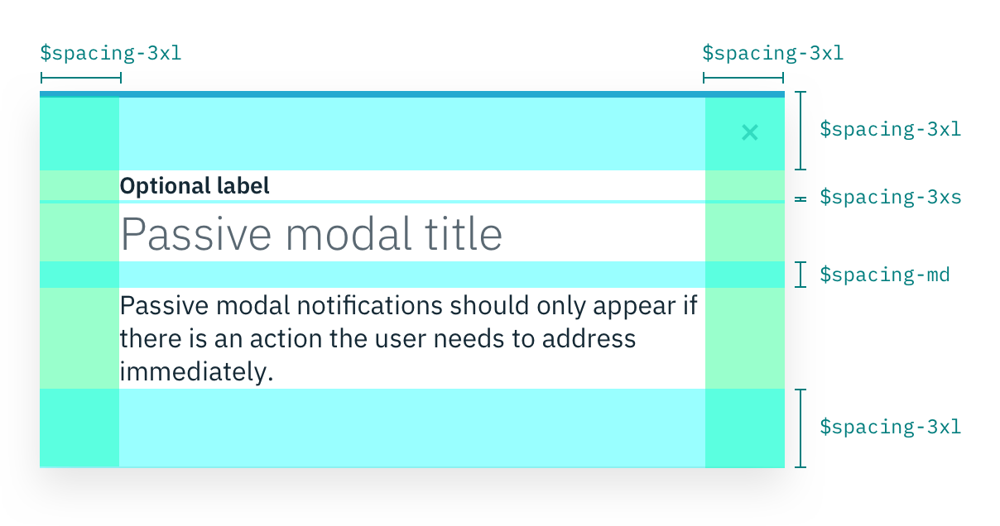
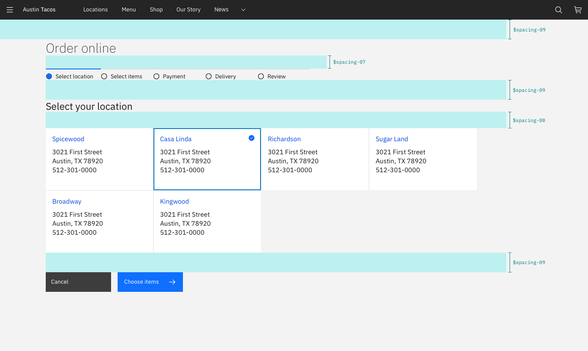

<anchor-links>
<ul>
    <li><a href="#carbon's-two-scales">Carbon's two scales</a></li>
    <li><a href="#spacing-scale">Spacing scale</a></li>
    <li><a href="#layout-scale">Layout scale</a></li>
    <li><a href="#designing-with-space">Designing with space</a></li>
    <li><a href="#faq">FAQ</a></li>
</ul>
</anchor-links>


## Carbon's two scales

Carbon has two spacing scales; one for general spacing within components and the other for layout spacing. Both are designed to complement the existing components and typography throughout the system. The two scales have certain overlapping values that serve two different roles, so be mindful when picking a spacing token.

| Scale             | Purpose                                                                                                                                                                                                                             |
| ----------------- | ----------------------------------------------------------------------------------------------------------------------------------------------------------------------------------------------------------------------------------- |
| Spacing scale | Used for smaller, more refined spacing needs, specifically within the context of a component (i.e. the space between a label and a text input).                                                                                |
| Layout scale | Typically used for positioning components on a page (i.e., the space between a text field and a selector). |

### Applying spacing

Both the _spacing_ and the _layout_ scales can be applied to `margin` or `padding` properties. Likewise, these spacing tokens can be applied to both vertical and horizontal edges. The token takes the place of the values normally assigned to `margin` and `padding`. The following are all approved ways to syntactically apply Carbon spacing tokens:

```css
margin: $spacing-xs;
margin: $layout-sm $layout-2xs;
margin: $spacing-xl 0 $spacing-sm 0;
margin-right: $layout-lg;
padding: $spacing-sm;
padding: $layout-lg $layout-sm;
padding: $spacing-xl $spacing-sm 0 $spacing-sm;
padding-left: $spacing-auto;
```

## Spacing scale

Use the spacing scale when building individual components. It includes small increments needed to create appropriate spatial relationships for detail-level designs. This scale is applied and used within all Carbon components.

| Token             | rem   | px  | Example                                       |
| ----------------- | ----- | --- | --------------------------------------------- |
| **\$spacing-3xs** | 0.125 | 2   |   |
| **\$spacing-2xs** | 0.25  | 4   |   |
| **\$spacing-xs**  | 0.5   | 8   |    |
| **\$spacing-sm**  | 0.75  | 12  |    |
| **\$spacing-md**  | 1     | 16  |    |
| **\$spacing-lg**  | 1.5   | 24  |    |
| **\$spacing-xl**  | 2     | 32  |    |
| **\$spacing-2xl** | 2.5   | 40  |  |
| **\$spacing-3xl** | 3     | 48  |  |

<image-component cols="6" caption="Example of spacing tokens applied">



</image-component>

### Other spacing options

There are a few other non-token methods that can be used for spacing elements. Each has its own unique use case.

| Method   | Purpose                                                                                                                                                           |
| -------- | ----------------------------------------------------------------------------------------------------------------------------------------------------------------- |
| `center` | Used to fluidly center an element between two edges.                                                                                                              |
| `auto`   | Used on one side of an element to allow undefined space to automatically grow and shrink according to screen size. Typically used for asymmetrical fluid spacing. |
| `gutter`   | Used to space items between the grid's 12 columns                                                                                                                 |

## Layout scale

The layout scale is used for arranging components and other UI parts into a full page layout. It has larger increments that are used to control the density of a design. Use the smaller layout tokens to create more dense compositions and direct relationships. Use the larger tokens to increase the amount of white space and to disassociate sections.

| Token            | rem | px  | Example                                      |
| ---------------- | --- | --- | -------------------------------------------- |
| `$layout-01` | 1   | 16  |  |
| `$layout-02`  | 1.5 | 24  |   |
| `$layout-03`  | 2   | 32  |   |
| `$layout-04`  | 3   | 48  |   |
| `$layout-05`  | 4   | 64  |   |
| `$layout-06` | 6   | 96  |   |
| `$layout-07` | 10  | 160 |  |

<image-component cols="6" border="true" caption="Example of layout tokens applied">



</image-component>


### Using layout scale with the grid

The Carbon grid is the encouraged way to horizontally space UI elements. The layout scale is most commonly used for vertical spacing, but it can also be applied for horizontal spacing when appropriate, especially in the case of fixed spacing.

## Designing with space

Every part of a UI should be intentional including the empty space between elements. The amount of space between items creates relationships and hierarchy.

### Creating relationships

Elements in a design that are near each other are seen as being meaningfully related. As more space is added between elements, their perceived relationship weakens.

Patterns created through spacing can also create relationships. Elements arranged in the same spacing pattern are seen as related pieces that have equal weight.

Space can also be used to denote groups of associated information. This creates content sections on a page without having to use lines or other graphical elements as a divider.

### Creating hierarchy

Elements that have more spacing around them tend to be perceived as higher in importance than elements that have less space around them. Take this page for instance. The top level headers have more space surrounding them giving them focus and prominence. Then as the headers descend in importance they receive less space, signaling they are subordinate.

Elements that are set close to each other can be easily overlooked. Users may see the grouping but not process each individual item. Therefore, if you have an element or content of high importance on the page, consider giving it extra surrounding space to help it attract focus.

### White space

Empty space — also known as white space — is important in design. It can be used to break up sections on a page or to help create focus on certain element(s). White space helps with information processing; too much dense information can be disorienting or overwhelming for a user. Sections of a UI are allowed to be dense, but the whole page should not be crowded; there should be white space to let the user’s eye rest.

## FAQ

##### Are spacing increments outside of the scale allowed?

There are always exceptions to the rule, but deviating from the spacing scales should be avoided whenever possible.

##### Can I still use the Carbon grid for horizontal spacing?

Yes, in fact it's encouraged.

##### Can I still use percentages for spacing?

Percentages like 50% (1/2) or 33% (1/3) are still acceptable ways to divide a page. Percentages can all still be used to control max and min widths. However, using percentages for padding or margin inside of a component or element should be avoided (ex. `padding-right: 10%`). The exception to this is if you’re applying it to fit the 5% grid margins.

##### Are the spacing tokens responsive?

No, the tokens themselves do not change values based on the screen size. However, it is acceptable at page breakpoints to jump a step(s) on the spacing scale to fit spacing needs (i.e., at 1440 px `padding-right: $spacing-md` but at breakpoint 768px `padding-right: $spacing-xs`).
