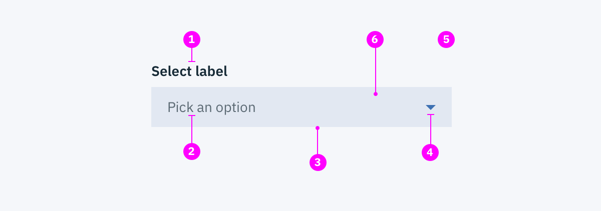

<page-intro>**Carbon Themes** are used to customize components to fit the specific needs of a brand or product.</page-intro>

## Introduction to theming

Developers and designers can use Carbon Themes to modify existing components to fit their own specific visual styles and needs. Rather than changing each individual component's CSS or building modified components from scratch, components can now be easily customized by changing a set of universal variables that seamlessly propagate across all of the components.

<p><a href="http://themes.carbondesignsystem.com/" target="_blank">Explore Themes</a></p>

### Theme terms

| Term         | Definition                                                                                                     |
| ------------ | -------------------------------------------------------------------------------------------------------------- |
| **Theme**    | The set of unique values assigned to the universal variables.                                                   |
| **Value**    | A theme's unique styles (ie hex code, line weight etc) assigned to a universal variable.                        |
| **Role**     | The systematic usage/s of a value. Roles cannot be changed between themes.                                     |
| **Variable** | The code identifier for a unique role or set of roles. Variables are universal and never change across themes. |

## IBM Cloud theme

The Carbon Design System has a default theme which is based off of the IBM Cloud UI and IBM Design Language. When `carbon-components` is downloaded and installed, they are preset to use the default theme.

The default theme acts as a starting point; from there designers and developers only need to define how their own components and styles deviate from the default. A theme can change all of the values or as little as only one. Those different values are then packaged into a new theme which when called will override the values of the default.

[Carbon Themes repo](https://github.com/carbon-design-system/carbon-themes)

## Variables

By using variables developers only need to make a change in one place to see a system wide change. They are used across multiple components and make it easy for components to be systematically updated while keeping global patterns and styles consistent.

All variables come pre-baked into the Carbon component source code. Variables are denoted by the prefix `$` (eg. `$brand-01`).

There are two categories of variables: **color** and **global.**

### Color

Each theme is assigned 25 universal color variables, which are determined by [common roles and usage](/guidelines/color/usage). This allows for uniform color application across themes while giving each theme the freedom to express its own personality.

```scss
//// Carbon
// Color Variables
$brand-01: $color__blue-51 !default;
$brand-02: $color__blue-40 !default;
$brand-03: $color__teal-20 !default;
$inverse-01: $ibm-colors__white !default;
$inverse-02: #272d33 !default;
$ui-01: $ibm-colors__white !default;
$ui-02: #f4f7fb !default;
$ui-03: $color__gray-1 !default;
$ui-04: #8897a2 !default;
$ui-05: $color__navy-gray-6 !default;
$text-01: $color__blue-90 !default;
$text-02: $color__navy-gray-6 !default;
$text-03: #cdd1d4 !default;
$field-01: #f4f7fb !default;
$field-02: $ibm-colors__white !default;
$support-01: #e0182d !default;
$support-02: $color__green-40 !default;
$support-03: $color__yellow-30 !default;
$support-04: $color__blue-30 !default;
$nav-01: $color__navy-gray-1 !default;
$nav-02: $color__blue-90 !default;
$nav-03: $color__purple-30 !default;
$nav-04: $color__purple-60 !default;
$nav-05: $color__teal-40 !default;
$nav-06: $color__teal-50 !default;
$nav-07: $color__blue-30 !default;
$nav-08: $color__blue-51 !default;

$hover-primary: darken($brand-01, 10%) !default;
$hover-primary-text: darken($brand-01, 15%) !default;
$hover-danger: darken($support-01, 10%) !default;
$hover-secondary: $brand-01 !default;
$hover-row: rgba($brand-02, 0.1) !default;
```

### Global

The other categories are global and component specific variables. These control more general styling of components, such as layer usage or border width.

```scss
// Global
$input-border: 1px solid transparent !default;
$input-label-weight: 600 !default;

// Button Theme Variables
$button-font-weight: 600 !default;
$button-font-size: 0.875rem !default;
$button-border-radius: 0 !default;
$button-height: 40px !default;
$button-padding: 0 $spacing-md !default;
$button-padding-sm: 0 $spacing-xs !default;
$button-border-width: 2px !default;

// Accordion (Reverse)
$accordion-flex-direction: row !default;
$accordion-justify-content: flex-start !default;
$accordion-arrow-margin: 0 0 0 $spacing-2xs !default;
$accordion-title-margin: 0 0 0 $spacing-md !default;
$accordion-content-padding: 0 $spacing-md 0 $spacing-2xl !default;

// Card
$card-text-align: center !default;
$card-flex-align: center !default;

// Checkbox
$checkbox-border-width: 2px !default;

// Code Snippet
$snippet-background-color: $ui-01 !default;
$snippet-border-color: $ui-03 !default;

// Content Switcher
$content-switcher-border-radius: 8px !default;
$content-switcher-option-border: 1px solid $brand-01 !default;

// Data Table
$data-table-heading-transform: uppercase !default;
$data-table-heading-border-bottom: 1px solid $brand-01 !default;
$data-table-row-height: 2rem !default;

// Modal
$modal-border-top: $brand-01 4px solid !default;
$modal-footer-background-color: $ui-02 !default;

// Progress Indicator
$progress-indicator-bar-width: 1px inset transparent !default;
$progress-indicator-stroke-width: 5 !default;
$progress-indicator-line-offset: 0.625rem !default;

// Radio Button
$radio-border-width: 2px !default;

// Structured Theme Variables
$structured-list-padding: 2rem !default;
$structured-list-text-transform: none !default;

// Skeleton Loading
$skeleton: rgba($color__blue-51, 0.1) !default;
```

## Theming applied

The following examples demonstrates the relationship between the different theming elements. Each element has a variable, a role, and a value determined by its theme.

### Default theme applied



| Key | Variable        | Role               | Value                   | Theme   |
| --- | --------------- | ------------------ | ----------------------- | ------- |
| 1   | `$text-01`      | Primary text       | `#152935`               | Default |
| 2   | `$text-03`      | Hint text          | `#cdd1d4`               | Default |
| 3   | `$input-border` | Input border       | `1px solid transparent` | Default |
| 4   | `$brand-01`     | Primary icon       | `#3d70b2`               | Default |
| 5   | `$ui-02`        | Default background | `#f4f7fb`               | Default |
| 6   | `$field-01`     | Field background   | `#152935` @ 10%         | Default |

### Custom theme applied

Here is the same component but with a different theme applied. Notice how only the values and theme items changed. The variables and role are the same for both.


| Key | Variable        | Role               | Value              | Theme  |
| --- | --------------- | ------------------ | ------------------ | ------ |
| 1   | `$text-01`      | Primary text       | `#272727`          | Watson |
| 2   | `$text-03`      | Hint text          | `#777677`          | Watson |
| 3   | `$input-border` | Input border       | `1px solid $ui-04` | Watson |
| 4   | `$brand-01`     | Primary icon       | `#047cc0`          | Watson |
| 5   | `$ui-02`        | Default background | `#f6f6f6`          | Watson |
| 6   | `$field-01`     | Field background   | `#ffffff`          | Watson |
