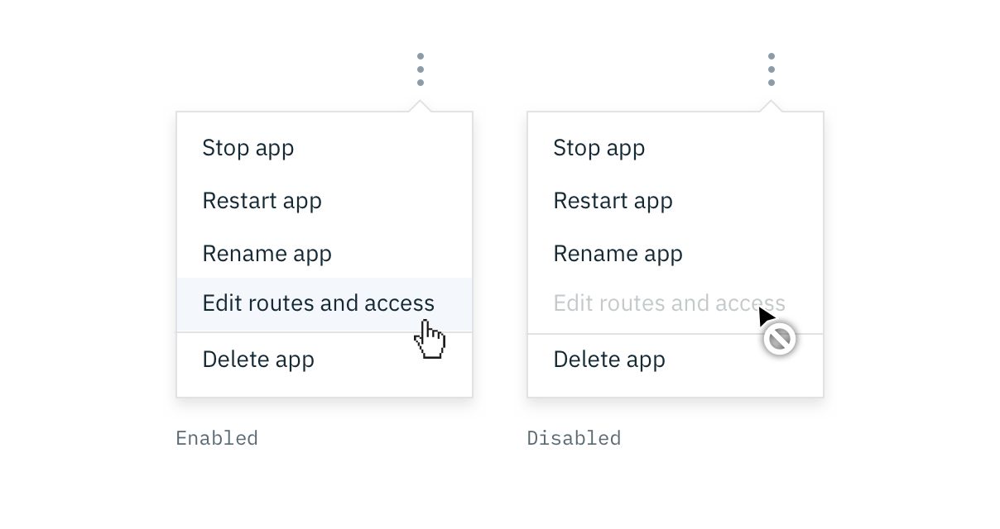
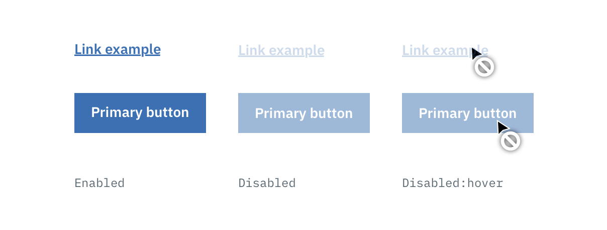
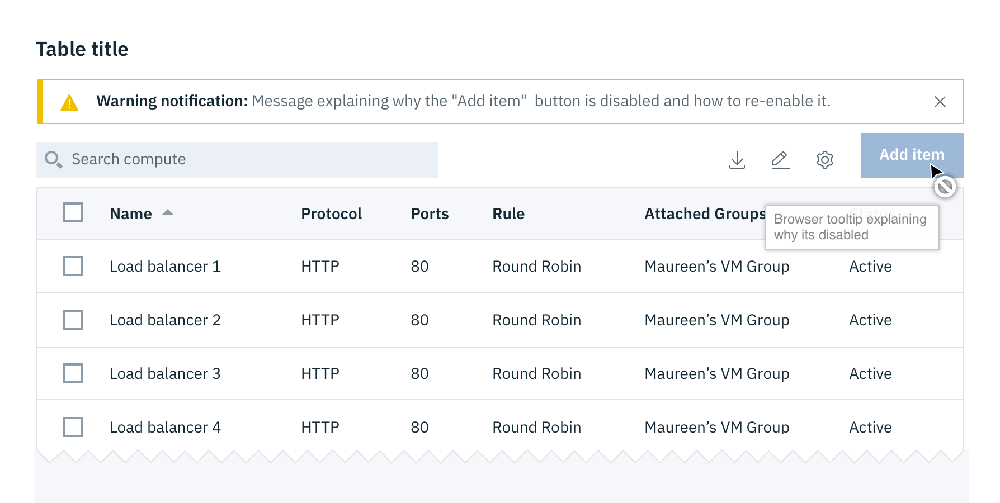
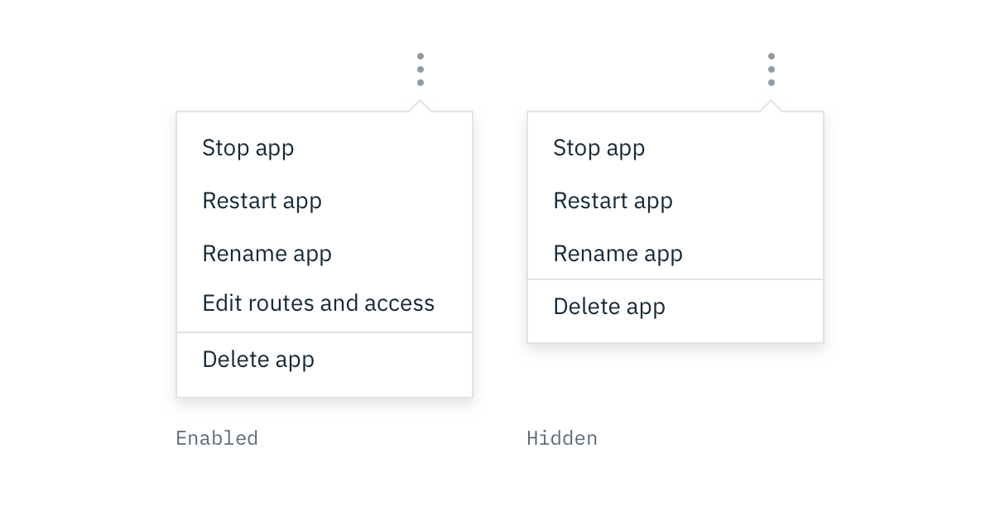

<page-intro>**A disabled state** is applied to a component when the user is not allowed to interact with the component due to either permissions, dependencies or pre-requisites. Disabled states completely remove the interactive function of a component.</page-intro>

## Disabled variations

| Variation            | Description                                                                                                                                                                                                                           |
| -------------------- | ------------------------------------------------------------------------------------------------------------------------------------------------------------------------------------------------------------------------------------- |
| **Default disabled** | Cannot be clicked, selected or interacted with. It is not read by a screen reader and takes on the default disabled visual style.                                                                                                     |
| **Read-only**        | The user cannot interact with it but content is still readable & accessible to a screen reader. The visual style should contain no interactive indicators such as `$brand-01`, hover states, or text embellishments (ie. underlines). |
| **Hidden**           | The component is completely hidden from view. The user does not know the option is there.                                                                                                                                             |

## Default disabled

A default disabled state is used when a component is temporarily disabled due to dependencies (when one piece of software relies on another one) or pre-requisites. This scenario is a temporary state change that is most commonly triggered by a user's action or inaction. Once the dependencies have been resolved and/or the pre-requisites have been fulfilled the default disabled component returns to its enabled state. In a temporarily disabled scenario the component should never fully disappear from the user's view.

### Style

Default disabled states are most commonly styled by a decrease in opacity with no hover state change and `not-allowed` cursor applied. Refer to each individual component for the accurate disabled state.

| Attribute | Default disabled style |
| --------- | ---------------------- |
| Component | 50% opacity            |
| Text      | 25% opacity            |
| Icons     | 50% opacity            |
| Hover     | None                   |
| Cursor    | `not-allowed`          |

### Additional warning

An [Inline Warning Notification](http://carbondesignsystem.com/components/notification/code) can be shown in cases where a temporarily disabled item effects multiple items or the primary action of the flow. The Notification should describe how the user can enable or re-enable the disabled component.

## Hidden

The hidden disabled variation is used when something or someone does not have permission to view, interact with or take action on an element or content. This variation completely hides the component, page, action, etc. from the user's interface. The only way to enable the hidden element and have it resurfaced on the UI would be to change the assigned permission.

For example, when a user is the organization owner they are allowed to add members to the organization. Any users that are not an organization owner would not be shown the “Add member” button on a team directory page. Once the user is made an organization owner **then and only then** will the button be visible.

## Read-only

In scenarios where the content of a disabled component or element is still relevant to the user or important to task completion, then the read-only variation is used. This allows the user to read the information but not interact with or change it. Read-only content should always be accessible to a screen reader.

### Style

The visual style of the read-only states vary by component but should never contain any interactive indicators such as `$brand-01` color usage, hover states, or text embellishments (ie. underlines).
