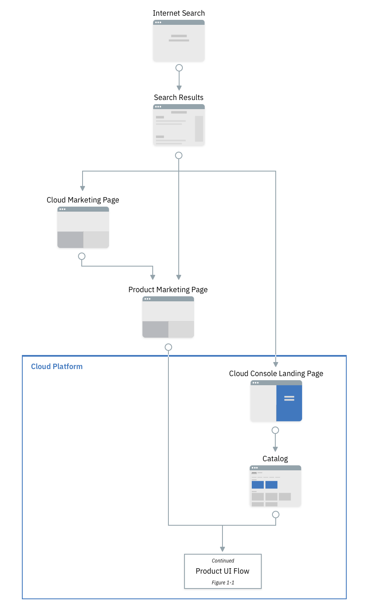
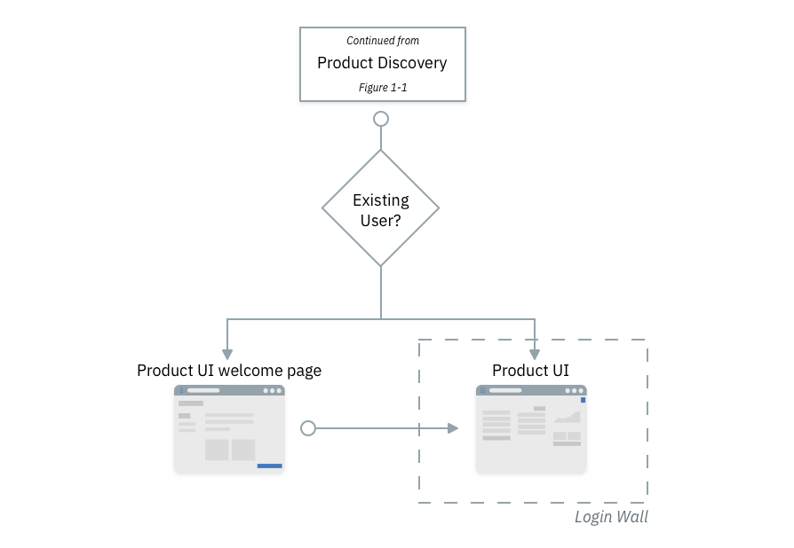
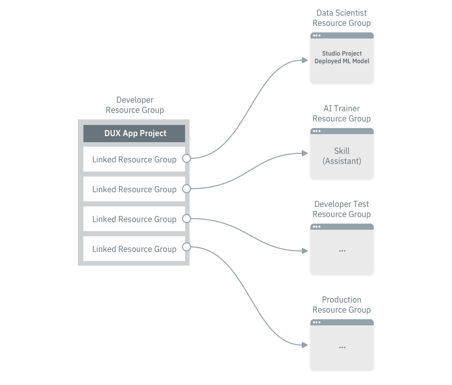

---

title: User Flow
internal: true
---

Users approach your product with specific goals in mind. When they achieve
their goals quickly, they feel a sense of power. Thoughtful content and clean
visual design add delight. Use this guidance to optimize the user's flow from
discovery of your product to productive use.

## Contents

1.  [Discovery](#discovery)

2.  [Product marketing page](#product-marketing-page)

3.  [Catalog](#catalog)

4.  [Product UI](#product-ui)

5.  [Evaluation](#evaluation)

6.  [Provisioning and loading](#provisioning-and-loading)

7.  [State memory](#state-memory)

8.  [First spend and increasing spend](#first-spend-and-increasing-spend)

9.  [Connecting](#connecting)

10. [Resources](#resources)

11. [Navigation](#navigation)

## Discovery

Every product has a set of public URLs for direct entry via internet search, and
is also listed in the IBM Cloud catalog. Users can discover and enter a product
in one of two primary ways:

1.  Direct entry by URL (from an internet search, product marketing page,
    solution page, or other link)

2.  Discovery in IBM Cloud catalog (or an embedded catalog component)

Users do not need to visit the Cloud Catalog or Dashboard in order to enter a
product. They can enter it directly, as illustrated in this user flow diagram:

The expected URL paths for your product are:

|                | Future Path                       | Legacy Path                        |
| -------------- | --------------------------------- | ---------------------------------- |
| Product UI     | cloud.ibm.com/{product}           | console.bluemix.net/{product}      |
| Marketing page | ibm.com/cloud/{product}           | -                                  |
| Docs           | ibm.com/cloud/{product}/docs      | console.bluemix.net/docs/{product} |
| API endpoint   | api.ibm.com/cloud/{product} [TBD] | -                                  |

## Product marketing page

Users discover your product via internet search, forums, tweets, partner
promotions, etc. They come to your product marketing page to understand how the
product can help them. You supply all the metadata for this page. Answer the
user's questions, including:

- What job does this product do for me?

- What are its differentiating features?

- Why should I use this product over a competing one?

- What does it cost? What is it likely to cost for my level of usage?

- If I decide to use it, what will I be doing?

Be clear about the job the product will do for the user. Content should focus on
technical accuracy and avoid unexplained buzzwords.

The conversion performance of the product marketing page, along with the usage
of the product itself, will determine how highly the product is ranked in the
catalog.

## Catalog

When the user finds your product in the catalog and clicks on it, they will be
taken directly into the product UI. This is a change from previous flows
(2014-2017).

Optionally, the user can click a secondary action to browse to the corresponding
product marketing page or documentation home page.

## Product UI

When a user lands on your product UI for the first time, show a welcome screen.
Briefly state what job the product will do for them. Tell the user the first 3
things they will achieve with it.

Do not act like a product marketing page. Link out to the product marketing page
for details of features and pricing. Only summarize key points here.

Show a guided walkthrough on first entry into the product UI. (See next section,
[Evaluation](#evaluation).)

Once the user has interacted with your product (e.g. by creating a resource),
skip the welcome screen on entry.

## Evaluation

When a user first begins using your product, they are in an evaluation phase.
The user is trying to understand what your product does, achieve a few small but
concrete things, and determine whether it has enough value to bet a full project
on it. During evaluation, the user must gain a clear understanding of what job
your product will do for them, and be able to achieve three basic milestones:

1.  Create a resource

2.  Modify the resource in a meaningful way, and confirm the impact of that
    change

3.  Connect the resource to another resource in another product to achieve some
    sort of workflow

A guided walkthrough is an essential tool for enabling the user to achieve this.
(Future) Use the walkthrough component.

## Provisioning and Loading

Perceived performance is absolutely essential on a cloud platform. When a user
enters your product, either from the IBM Cloud catalog or via direct link, it should
load [within two
seconds](https://medium.com/@vikigreen/impact-of-slow-page-load-time-on-website-performance-40d5c9ce568a).
Users will interpret slow loading performance as a sign of how their own app or
data project will perform on the platform.

When content is not available immediately, show skeleton states. This gives the
user a frame of reference for where to expect the content to appear. Use the
skeleton states shown for each component [in the
storybook](http://react.carbondesignsystem.com/).

When creating a resource, wait times of several seconds or even minutes are not
unusual. Do not make the user wait until provisioning is complete to see the
resource appear. Show the resource in list views, and allow the user to drill
into its details page, even before it is fully provisioned. Display whatever
information is available. If the provisioning fails with an error, show the
error state and let the user correct it from the Details page.

## State memory

When the user returns to your product, the system will restore the state in
which they left it. To achieve this, developers must store the essential state
elements in the URL. The Shell will track the URL and return the user to that
URL automatically upon return.

(Future) To store more advanced state than what can fit in a URL, place it in
the user profile object, then retrieve it when the product UI loads. If user
profile data is corrupt or non-applicable, discard it and fail silently.

## First spend and increasing spend

There is no single moment when a cloud user decides to buy. Users will make many
spending decisions, with progressive levels of commitment. Your product should
encourage small spending upfront for a well-defined benefit, then scale up from
there as the user becomes increasingly confident in the value provided and the
predictability of its cost.

When crafting your pricing plan, ensure the user receives clear, tangible value
for the first dollar spent. A free tier is useful but not sufficient to make the
user confident that the first dollar spent will be worthwhile. Meanwhile, a user
who spends one dollar and feels confident they obtained value from it, will
happily spend hundreds or thousands of dollars when ready to scale up their
project.

Reserve enterprise-class features such as large scale, load balancing,
encryption, and fine-grained security, for premium pricing tiers. Make it
possible to test these premium-priced capabilities, so the user is confident
they actually work as intended.

## Connecting

IBM Cloud is designed to enable teams to collaborate around data. Your product
should connect to at least one or two other products to either get or put data.

(Future) Leverage our embeddable connect widget within your user flows to enable
the user to quickly select a resource within another product, then either get
data from that resource or send data to it.

Employ the connect flow as follows:

1.  Place the connect button/icon within your product UI.

2.  When triggered, the user selects a target resource within another product

3.  The target product provides a custom workflow action.

(Future) To make your product's resources a target for other products to
consume, implement the connect workflow action (step 3 in the flow above). When
your product registers with the cloud resource controller, its connect
capabilities will be registered for use by other products.

## Resources

Users can browse all their resources by visiting the resource list in the
dashboard. The purpose of the resource list is to help users find things they've
created and worked on previously, and to provide a lookup system for making
connections between resources. It is not meant to give a fine-grained view of
every detail of a resource. To see granular data, the user must open the
resource in its product UI.

Expose Resources using a coarse-grained granularity that is sufficient enough
to:

1.  help the user find a prior piece of work without wading through many
    detailed elements

2.  look up the resource when establishing a connection

3.  share the resource with other users

When determining granularity, compare your candidates to filesystem documents
that feel familiar. You would not expose a separate file in the user's documents
folder for every slide of a slide deck or every sheet in a workbook, or every
element in a graphic design file.

Likewise, a product that is managing a complicated Machine Learning Model with
many nodes and parameters should only expose one resource corresponding to the
model, not many resources corresponding to each of the individual nodes. A
product managing a complex build pipeline for developers could expose just one
resource for the entire pipeline.

A database product could expose each database as a resource, but not the tables
or rows.

## Navigation

Users can switch between your product and another one quickly by clicking the
Application Switcher icon or its keyboard shortcut. Your product will appear
there after the user has browsed to it and interacted with it. (Future: See
Application Switcher.)
